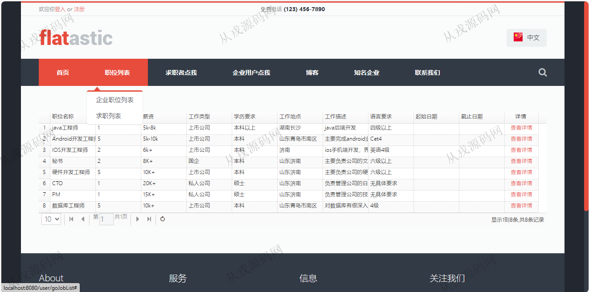
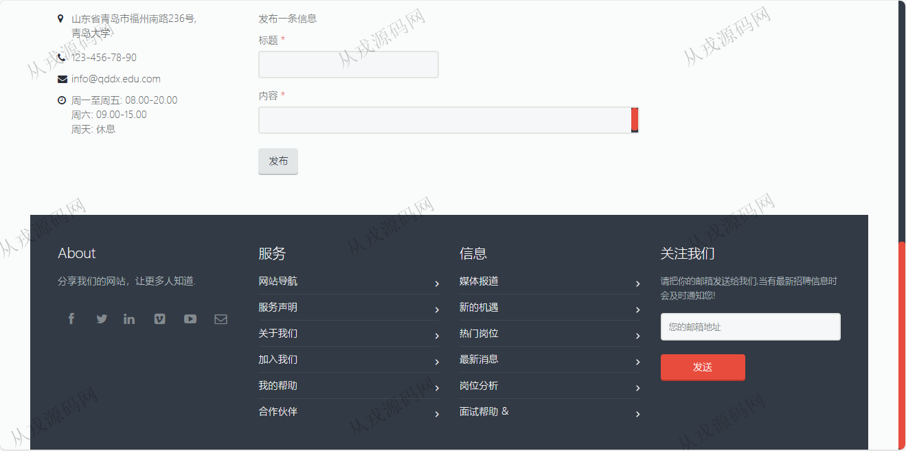
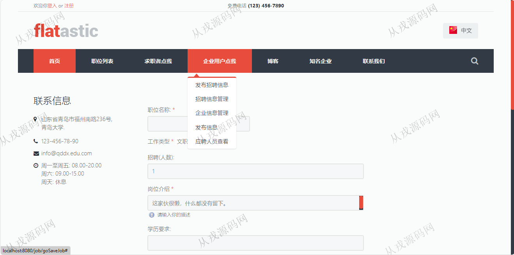
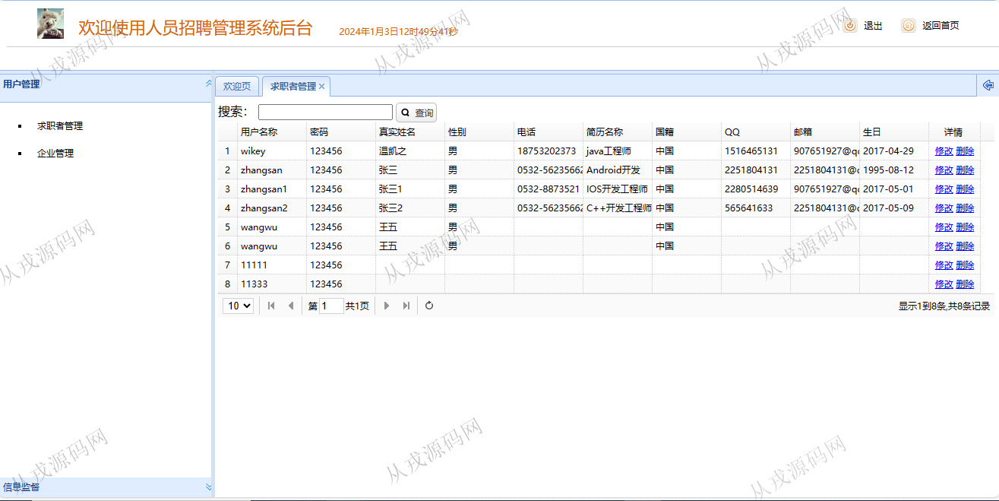
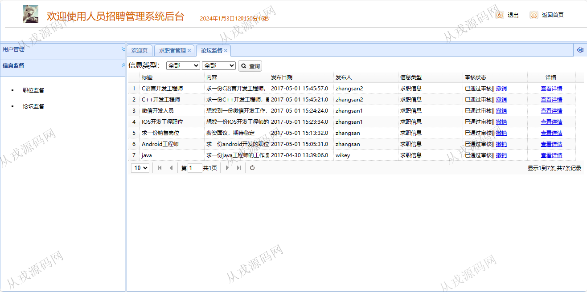

<h1 align="center">98.招聘之家管理系统</h1>

 获取sql文件 QQ: 386869957 QQ群: 377586148 

 [推荐站点: 从戎源码网](https://armycodes.com/) 

## 简介

> 本代码来源于网络,仅供学习参考使用!
>
> 提供1.远程部署/2.修改代码/3.设计文档指导/4.框架代码讲解等服务
> 
> 管理后台：http://localhost:8080/recruit/admin/goMain
> 
> 管理员：admin 123456
> 
> 用户端：http://localhost:8080/recruit/goMain
> 
> 用户：wikey 123456
>

## 项目介绍
基于ssm的招聘之家管理系统：前端 jsp、jquery、easyui，后端 spring、shiro、mybatis，角色分为管理员、医生、用户；集成发布求职信息，我的求职信息、发布招聘信息、职场博客等功能于一体的系统。

## 功能介绍

### 用户

- 基本功能：登录、注册、退出
- 网站首页：主导航栏，轮播图、最热职位、企业LOGO
- 职位列表：企业职位列表展示，查看详情，求职列表，求职详情页
- 求职者点我：发布求职信息，我的求职信息，我的信息，浏览职位历史
- 企业用户点我：发布招聘信息，招聘信息管理，企业信息管理，发布信息，应聘人员查看
- 博客：职场博客
- 知名企业：查看知名企业

### 管理员

- 求职者管理：求职者用户信息的列表查询，修改和删除
- 企业管理：企业信息列表查询，修改和删除
- 职位信息：职位信息的列表查询，修改和删除
- 论坛监督：论坛信息的列表查询，查看详情，审核和撤销

## 环境

- <b>IntelliJ IDEA 2021.3</b>

- <b>Mysql 5.7.26</b>

- <b>Tomcat 7.0.73</b>

- <b>JDK 1.8</b>

## 运行截图

